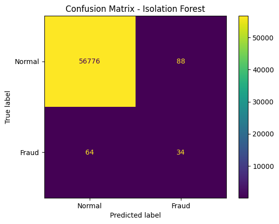
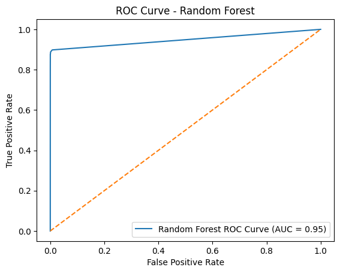

# Fraud Detection using Machine Learning

## 📌 Overview

This project presents a comparative analysis of supervised and unsupervised machine learning techniques for fraud detection in highly imbalanced financial datasets.

## 🎯 Objective

To evaluate the performance of:

* Random Forest (Supervised)
* Isolation Forest (Unsupervised)

## 📊 Dataset

* Public financial fraud dataset (Kaggle or equivalent)
* Highly imbalanced (fraud cases are rare)

## ⚙️ Methodology

1. Data preprocessing and cleaning
2. Feature engineering
3. Model training
4. Performance evaluation using:

   * Precision
   * Recall
   * F1-score

## 📈 Visual Results

### Random Forest

* High precision and recall
* Effective in detecting fraud cases

### Isolation Forest

* Lower recall due to unsupervised nature
* Useful for anomaly detection

## 📷 Sample Output

See results folder for confusion matrix and ROC curves.

## 🧠 Key Insight

Supervised models outperform unsupervised models in fraud detection when labeled data is available, especially in imbalanced datasets.

## 🔗 Research Paper

Available on SSRN: https://papers.ssrn.com/sol3/papers.cfm?abstract_id=6551519

## 👤 Author

Hammad Sheikh
IT Manager | Cybersecurity Specialist | Independent Researcher
